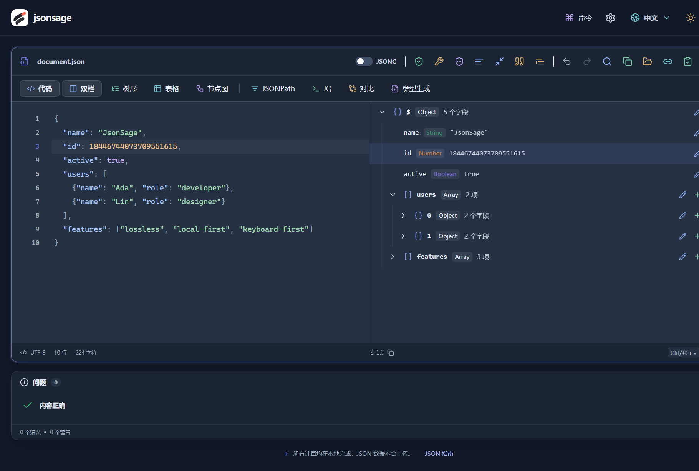

<p align="center">
  
</p>

<h1 align="center">JsonSage</h1>

<p align="center"><strong>看清 JSON，保持精度，数据留在本地。</strong></p>
<p align="center">一个基于 CodeMirror 6 的 JSON / JSONC 网页工具。编辑、查询、对比和类型生成，在浏览器里完成。</p>

<p align="center">
  <a href="https://github.com/zhanpoint/jsonsage/actions/workflows/deploy.yml"></a>
  <a href="LICENSE"></a>
  <a href="https://codemirror.net/"></a>
  <a href="#隐私与离线"></a>
</p>

<p align="center">
  <a href="https://jsonsage.dreamlog.xyz/">在线使用</a> ·
  <a href="#快速启动">快速启动</a> ·
  <a href="#功能一览">功能一览</a> ·
  <a href="#部署">部署</a> ·
  <a href="https://github.com/zhanpoint/jsonsage/issues">反馈问题</a>
</p>



<p align="center"><sub>当前应用的真实界面：选择树节点，代码和底部路径同步定位。截图使用演示数据。</sub></p>

## 为什么用 JsonSage

- **保留长整数**：格式化、压缩、树形展示、JSONPath 和结构对比保留数字原文，雪花 ID 不会变成另一串数字。
- **减少等待**：CodeMirror 虚拟视口、虚拟滚动与 Web Worker 分担编辑、计算和渲染；大文件采用分支浏览和分页。
- **用熟悉的方式看数据**：代码、树形、表格、节点图随时切换，双栏模式让代码与树节点相互定位。
- **从问题到结果**：精确到行列的诊断、一键修复、JSONPath / JQ 查询和结构对比，覆盖常见调试流程。
- **键盘完成操作**：命令面板、默认快捷键、自定义键位；格式化和复制结果遵循设置的缩进。
- **数据留在本地**：无后台解析、无分析脚本；生产版支持 PWA 安装和离线使用。

## 快速启动

需要 **Node.js 24 LTS**、随 Node 安装的 npm，以及 Git。

```sh
git clone https://github.com/zhanpoint/jsonsage.git
cd jsonsage
npm ci
npm run dev
```

打开 [http://127.0.0.1:5174](http://127.0.0.1:5174)。无需数据库、API Key 或后端服务。

**试一试**：将下面的 JSON 放进代码视图，按 `Ctrl / ⌘ + Enter` 格式化，再打开「双栏」查看节点。

```json
{
  "id": 18446744073709551615,
  "users": [
    { "name": "Ada", "role": "developer" },
    { "name": "Lin", "role": "designer" }
  ],
  "active": true
}
```

在 **JSONPath** 输入 `$.users[*].name`，找到两个姓名；在 **JQ** 输入 `.users[] | {name, role}`，提取所需字段。右键字段可复制它的路径。

构建和本地查看生产版：

```sh
npm run build
npm run preview -- --host 127.0.0.1 --port 5175
```

打开 [http://127.0.0.1:5175](http://127.0.0.1:5175)。PWA 在生产构建中启用，开发模式不注册 Service Worker。

## 功能一览

| 功能 | 你可以做什么 |
| --- | --- |
| **代码编辑** | JSON / JSONC 高亮、行号、折叠、括号匹配；使用 CodeMirror 原生查找替换和撤销重做 |
| **多视图** | 树节点增删改；对象数组自动提取表头；层级节点图支持深度、缩放和平移；双栏默认关闭 |
| **诊断与修复** | 中英文错误说明、行列定位、红色波浪线；修复单引号、未引号键、尾逗号、注释等输入 |
| **JSONPath / JQ** | 用通配符、递归、数组切片定位节点；JQ 过滤、投影和转换，JQ 结果可复制、导出或替换当前内容 |
| **结构对比** | 左右两列比较，区分新增、删除、值修改和类型变更；对象键顺序不同仍可判定相等 |
| **类型生成** | 从样本推断 TypeScript、Python、Go、Rust 类型，在本地生成并复制或导出 |
| **导入与导出** | 本地 UTF-8 文件选择、拖放，URL / GET cURL 导入；导出 `.json`、复制原文或格式化结果 |
| **智能粘贴与脱敏** | 正常粘贴时识别 URL、JWT、Base64、转义 JSON；脱敏常见敏感字段、电话、邮箱和 IP 等 |

### 设置与快捷键

编辑器设置提供 **2 空格、4 空格和 Tab** 缩进；编辑、格式化、修复和生成结果共用此设置。支持明暗主题、主题配色、中文 / English 和自定义快捷键，偏好自动保存在本机。

下表中 `Mod` 表示 Windows / Linux 的 `Ctrl`，或 macOS 的 `⌘`。

| 默认快捷键 | 操作 |
| --- | --- |
| `Mod + K` | 打开命令面板；方向键选择，Enter 执行，Esc 关闭 |
| `Mod + Enter` | 格式化当前编辑器 |
| `Mod + F` | 查找与替换 |
| `Mod + Alt + B` | 开关代码 / 树形双栏 |
| `Mod + Alt + 1 … 8` | 依次切换代码、树形、表格、节点图、JSONPath、JQ、对比、类型生成 |
| `Mod + Alt + K` | 打开快捷键设置；检测重复键位并支持恢复默认 |

其他操作的快捷键可在命令面板中查看。系统或浏览器保留的组合键可能无法覆盖。

状态栏常驻当前节点路径，右键字段或点击路径可选择复制格式：

| 格式 | 示例 |
| --- | --- |
| JSONPath | `$.users[0].name` |
| JavaScript | `res.users[0].name` |
| JQ | `.users[0].name` |
| JSON Pointer | `/users/0/name` |

## 隐私与离线

**输入的 JSON 只存在于当前页面内存，刷新页面会清除。** 解析、修复、查询、对比和类型生成在浏览器本地运行，不上传输入内容，不依赖第三方计算服务或 CDN。

- `localStorage` 只保存主题、语言、缩进和快捷键等偏好；离线缓存只保存应用资源。
- 主动导入 URL，或粘贴 URL 触发智能导入时，浏览器会请求该地址；请求不附带 Cookie 和 Referrer，受目标服务的 CORS 限制。
- 首次通过 **HTTPS 或 localhost** 打开生产版并完成资源缓存后，可断网重新访问，包括 JQ WASM。支持安装的浏览器会显示安装操作。
- JWT 功能只解码 payload，不验证签名；Base64 是解码。修复可能推断缺失内容，规则脱敏也可能遗漏业务自定义字段，使用或分享前请核对结果。

<details>
<summary><strong>精度与大文件处理：机制和边界</strong></summary>

数字通过原始 token 与 `lossless-json` 保存，格式化和压缩不经过会丢失长整数的原生 `JSON.parse` / `JSON.stringify` 往返。结构对比不使用浮点数判断数字等值；数组按索引比较。

**JQ 数值运算仍遵循其 IEEE 754 浮点数语义**，不要对需要保持精度的 ID 做算术运算。类型生成来自输入样本，不能替代完整业务 schema；生成的 TypeScript `number` 也不代表下游可精确表示超大整数。

编辑器仅渲染可见区域；校验、转换、查询、对比、类型生成和索引使用 Worker。连续输入合并文本快照，过期任务会取消，避免异步结果覆盖后续编辑。

| 边界 | 当前策略 |
| --- | --- |
| 文件 / URL 导入 | 最大 128 MiB；严格检查 UTF-8 编码 |
| 常规语法树 | 最多 200 万 UTF-16 字符、100,000 节点、256 层；超出后切换分支浏览和分页 |
| 大文件树 | 每页 300 个直接子节点；复杂增删改在代码视图完成 |
| 节点图 / 表格 | 图最多 300 节点，表格最多 100 列；图展示 JSON 层级 |
| 查询 / 对比 | 最多展示 5,000 个结果或差异标记；结构对比仍计算完整差异数量 |

重复键的树形数据只读，避免编辑路径歧义。虚拟滚动限制渲染量，但读取、解析和输出仍随数据量消耗时间与内存，不能保证任意设备处理任意输入都无等待。

运行 `npm run benchmark` 可在内存中生成约 100 MiB 的合成数据，测量校验、分支浏览、表格、节点图、压缩和格式化，直接输出耗时与进程峰值内存，不生成样本文件。该测试测量 Node 中的算法耗时，不是浏览器帧率测试。

</details>

## 部署

当前线上入口：[https://jsonsage.dreamlog.xyz](https://jsonsage.dreamlog.xyz/)。应用构建后是静态资源，可托管在支持 SPA 回退、正确模块 / WASM MIME 类型的静态服务器上。

<details>
<summary><strong>Docker Compose：本地运行或服务器部署</strong></summary>

需要 Docker Engine 和 Docker Compose v2。以下命令在项目根目录的 **Linux / macOS shell** 中执行：

```sh
cp .env.example .env
export APP_REVISION=$(git rev-parse HEAD)
export JSONSAGE_IMAGE=jsonsage:$APP_REVISION
docker compose up -d --build --wait
curl -fsS http://127.0.0.1:8088/healthz
```

`.env` 中 `APP_PORT=8088` 控制主机端口，`PUBLIC_HOST` 用于主机 Nginx 模板。修改端口后，检查地址也应相应修改。容器只绑定 `127.0.0.1`，公网入口需通过反向代理提供。

镜像采用 Node 24 / Nginx 多阶段构建，运行时仅包含静态资源与 Nginx，使用非 root 用户、只读文件系统，以及内存、进程和日志限制。`/healthz` 用于健康检查，`/version.json` 返回构建提交。

主机代理模板位于 `deploy/nginx.host.conf.template` 和 `deploy/nginx.https.conf.template`。渲染时只替换 `PUBLIC_HOST`、`APP_PORT`，保留 `$uri` 等 Nginx 自身变量；HTTPS 模板还需要对应域名证书。修改配置后先执行 `nginx -t`，再重载 Nginx。

</details>

<details>
<summary><strong>GitHub Actions：自动更新与运维</strong></summary>

工作流 [`CI and Deploy`](.github/workflows/deploy.yml) 在推送 `main` 时执行检查、测试、构建和发布；PR 只检查，也支持手动触发。服务器只接受当前 `origin/main` 的完整 SHA，避免过期任务发布旧代码。

当前服务器目录为 `/opt/jsonsage`。GitHub 的 `production` 环境配置如下：

| 类型 | 名称 | 用途 / 当前值 |
| --- | --- | --- |
| Secret | `SSH_PRIVATE_KEY` | JsonSage 专用部署私钥 |
| Secret | `SSH_KNOWN_HOSTS` | 已核验的服务器 SSH 主机公钥 |
| Variable | `SSH_HOST` | `47.82.79.170` |
| Variable | `SSH_PORT` | `22` |
| Variable | `SSH_USER` | `root` |
| Variable | `PUBLIC_URL` | `https://jsonsage.dreamlog.xyz` |

公开仓库无需 GitHub 密码、仓库访问令牌或镜像仓库密钥。迁移到新服务器时，需要安装 Git / Docker Compose、将仓库克隆至 `/opt/jsonsage`、配置 `.env` 和主机代理，并将 `deploy/ssh-entrypoint.sh` 安装到 `.ops/ssh-entrypoint.sh`。部署公钥在 `authorized_keys` 中配置 `restrict` 和该入口的强制命令，只允许 `deploy <SHA>`，不提供交互式 Shell 或端口转发。

构建期间继续运行原容器；新版本必须通过健康检查与版本检查，失败则恢复上一镜像。流水线还验证公网版本、JQ 模块 / WASM 和 PWA 清单的响应类型。历史镜像用于回滚，不进行影响其他项目的全局镜像清理。

管理员可在服务器检查当前发布：

```sh
cd /opt/jsonsage
export APP_REVISION=$(cat .ops/deployed-revision)
export JSONSAGE_IMAGE=jsonsage:$APP_REVISION
docker compose ps
docker compose logs --tail 100 app
curl -fsS http://127.0.0.1:8088/version.json
```

线上域名的阿里云 DNS 为 `jsonsage.dreamlog.xyz → 47.82.79.170`。独立的主机 Nginx 配置提供 HTTPS，域名 HTTP 自动跳转；Certbot 的续期定时器及 Nginx 校验 / 重载钩子负责自动续期。可用 `certbot renew --cert-name jsonsage.dreamlog.xyz --dry-run` 检查续期。公网 IP 的 HTTP 入口不具备 PWA 和部分剪贴板功能要求的安全上下文。

发布记录见 [GitHub Actions](https://github.com/zhanpoint/jsonsage/actions/workflows/deploy.yml)。部署行为参考 [Docker 多阶段构建](https://docs.docker.com/build/building/multi-stage/)、[Compose 健康等待](https://docs.docker.com/reference/cli/docker/compose/up/) 和 [GitHub Actions 密钥](https://docs.github.com/en/actions/security-for-github-actions/security-guides/using-secrets-in-github-actions)。

</details>

## 开发与贡献

React 19 + TypeScript + Vite；编辑器、各视图和计算层分离，重计算在 Worker 中执行。快捷键、工具栏和命令面板共用 `src/lib/commands.ts`，避免同一操作维护多套定义。

```text
src/components/   编辑器、各视图、菜单与对话框
src/hooks/        状态同步与计算任务调度
src/lib/          JSON 算法、路径、导入、快捷键与设置
src/workers/      本地计算任务
tests/            功能与部署回归测试
deploy/           Nginx 配置与发布脚本
scripts/          JQ 本地资源准备与性能测量
```

欢迎通过 [Issue](https://github.com/zhanpoint/jsonsage/issues) 提交可复现的问题，或从功能分支提交 PR 到 `main`。提交前运行：

```sh
npm test
npm run check:unused
npm run build
```

Linux 或具有 Bash 的环境还可执行 `bash tests/deploy.test.sh`；CI 会运行此部署回归测试。`npm run benchmark` 用于需要评估算法性能的改动。

## 致谢与许可证

基于 [MIT License](LICENSE) 开源。第三方依赖保留各自许可证，JQ 本地资源的许可证随构建保留。

编辑体验来自 [CodeMirror 6](https://codemirror.net/)，解析与转换使用 [jsonc-parser](https://github.com/microsoft/node-jsonc-parser)、[lossless-json](https://github.com/josdejong/lossless-json)、[jsonrepair](https://github.com/josdejong/jsonrepair)、[JSONPath Plus](https://jsonpath-plus.github.io/JSONPath/docs/ts/)、[jq-web](https://github.com/fiatjaf/jq-web) 和 [quicktype](https://github.com/glideapps/quicktype)。

交互与可视化使用 [Base UI](https://base-ui.com/)、[cmdk](https://github.com/pacocoursey/cmdk)、[TanStack Virtual](https://tanstack.com/virtual/latest) 和 [React Flow](https://reactflow.dev/)，界面参考 [21st](https://21st.dev/) 的组件设计。离线能力由 [Vite PWA](https://vite-pwa-org.netlify.app/) 提供。
